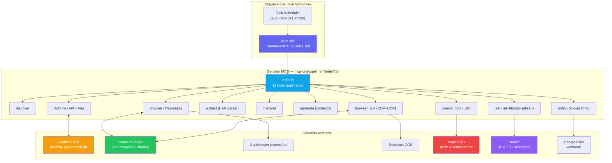
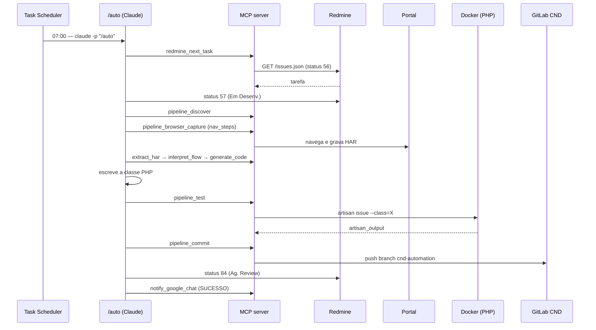

# 01 - Visão Geral e Arquitetura

← Voltar para [[CND Automation — Documentação Técnica|Home]]

## Propósito

Automatizar o ciclo completo de **descoberta → captura → interpretação → geração de código → teste → commit** das classes PHP que emitem certidões (Federal / Estadual / Municipal) consumidas pelo sistema **CND** da Questor.

### O problema que resolve

Cada nova prefeitura/órgão exige uma **classe PHP** que replica, request a request, o fluxo HTTP do portal de emissão da certidão. Feito à mão, o processo é:

1. Ler a tarefa no Redmine.
2. Navegar no portal e inspecionar o tráfego de rede.
3. Escrever a classe PHP replicando o fluxo.
4. Testar localmente (`artisan issue`).
5. Revisar e commitar.

O `cnd-automation` transforma esse esforço repetitivo numa execução **autônoma** orquestrada pelo Claude Code, com retry guiado por erro e uma [[16 - Knowledge Base e Memória de Time|knowledge base]] acumulativa.

### Entrada e saída

- **Input:** uma tarefa no Redmine do projeto `1106`, atribuída ao grupo "Desenvolvimento Web" (ID `1062`), em status **Ag. Desenv. (56)**, cujo subject começa com `Implementar` ou `Revisar`.
- **Output:**
  - commit no repositório **CND** (branch `cnd-automation`) com a classe PHP + atualização do `config/certificates.php`;
  - status no Redmine → **Ag. Review (84)** com nota padronizada;
  - card 🟢 no Google Chat;
  - arquivo de knowledge atualizado no repo CND.
- **Em caso de falha** (3 tentativas): status volta a **Ag. Desenv. (56)**, tarefa é **reatribuída** ao grupo Analista de Negócio (ID `875`) e um card 🔴 é enviado.

---

## Arquitetura

---

## Pontos-chave da arquitetura

- **A skill `/auto` é o cérebro.** O servidor MCP só expõe *tools atômicas*; a orquestração (qual tool chamar, em que ordem, quando retentar, como tratar falha) vive no [[05 - Skill auto — Orquestrador|SKILL.md]]. Isso permite evoluir o fluxo **sem rebuildar TypeScript** — basta editar o markdown.
- **HAR é a interface entre captura e interpretação.** O browser grava o tráfego em `WORK_DIR/har/{task_id}.har` com `mode="full"` + `content="embed"`, para que os bodies (HTML/JSON/PDF) cheguem inline — exigência do PHP downstream que faz parsing via `loadHiddenFieldsFromString`. Ver [[08 - Extração e Interpretação de HAR]].
- **Duas vias de captura.** [[06 - Captura de Browser — Playwright|Playwright]] é o caminho padrão; o [[07 - Fallback AHK — OCR + AutoHotkey|fallback AHK]] entra como 3ª tentativa quando o Playwright falha 2x e os passos são 100% baseados em texto.
- **PHP roda em Docker.** O repo CND é Laravel 6 / PHP 7.4; o host normalmente tem PHP 8+. Por isso o `pipeline_test` executa `artisan` **dentro do container** `configs-development-app-1` (PHP 7.3.33). Ver [[13 - Configuração — Variáveis de Ambiente]].
- **Persistência local mínima.** O único estado durável é a fila Redmine em `WORK_DIR/state/task_queue.json` (TTL 24h) e os HAR/PDF em `WORK_DIR/har/`. Não há mais "state file por tarefa" (o antigo `StateManager` foi removido).
- **Dois repositórios acoplados.** `cnd-automation` (este, a ferramenta) escreve dentro de `cnd` (o produto). A knowledge base e as classes geradas vivem no repo CND.

---

## Ciclo de vida de uma tarefa (visão macro)

---

## Veja também
- [[03 - Pipeline — Fluxo Completo]] — o fluxograma detalhado com decisões e retries.
- [[02 - Stack, Estrutura e Build]] — tecnologias e árvore de arquivos.
- [[Glossário]] — vocabulário do domínio.
