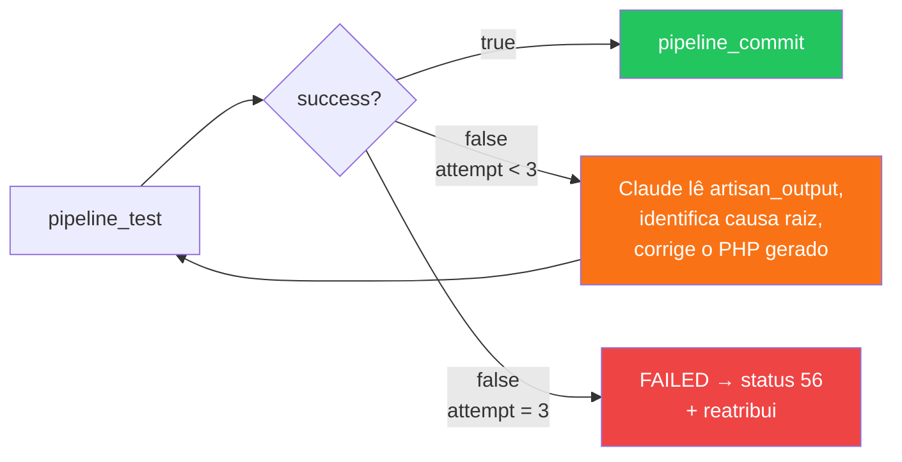

# 03 - Pipeline — Fluxo Completo

← Voltar para [[CND Automation — Documentação Técnica|Home]] · relacionado: [[05 - Skill auto — Orquestrador]]

Fluxograma do modo autônomo `/auto`, refletindo o estado atual do código: 13 passos, transição inicial de status no Redmine, fallback AHK, retry guiado por `artisan_output`, reatribuição em falha, notificações no Google Chat e push automático no commit.

---

## Fluxo completo

```mermaid
flowchart TD
    START([Início — Task Scheduler 07:00\nclaude -p /auto]) --> STOPCHK

    STOPCHK{"⏸ Existe arquivo\n.claude/STOP?"}
    STOPCHK -- "Sim" --> PAUSED([⏸ Pausado — encerra])
    STOPCHK -- "Não" --> LIMITCHK

    LIMITCHK{"contador >=\nMAX_TAREFAS (5)?"}
    LIMITCHK -- "Sim" --> LIMIT([🏁 Limite atingido — encerra])
    LIMITCHK -- "Não" --> NEXT

    NEXT["📥 redmine_next_task\nFila local (TTL 24h)\nSó status 56; pula 59;\nreatribui tarefas sem descrição"]
    NEXT -- "task: null" --> EMPTY([📭 Fila vazia — encerra])
    NEXT --> CLASSIFY

    CLASSIFY{"📑 Tipo (subject)"}
    CLASSIFY -- "Implementar" --> NEWNAME["✏️ Gerar class_name\nPascalCase (PASSO 3A)"]
    CLASSIFY -- "Revisar" --> READEXIST["📖 Extrair class_name de 'Certidão:'\nLer PHP existente (PASSO 3B)"]

    NEWNAME --> KB
    READEXIST --> KB

    KB["📚 PASSO 4 — knowledge base\n.claude/patterns/{type}/{class}.md\n.claude/patterns/bases/{Base}.md (no repo CND)"]
    KB --> DEV

    DEV["🟡 redmine_update_task → 57 (Em Desenv.)\n(se vier de 56, faz 56→57)"]
    DEV --> DISC

    DISC["🔍 PASSO 5 — pipeline_discover\nURL, CNPJ, fluxo, complexidade"]
    DISC --> BROWSER

    BROWSER["🌐 PASSO 6 — pipeline_browser_capture\nPlaywright headed + CapMonster\nnav_steps (text actions) → HAR"]
    BROWSER -- "failed_step?" --> RETRY_BR
    BROWSER --> EXTRACT

    RETRY_BR{"2ª falha?"}
    RETRY_BR -- "ajusta 1 step\n(via diagnostics)" --> BROWSER
    RETRY_BR -- "steps 100% texto" --> AHK
    RETRY_BR -- "tem selector/frame" --> PARTIAL

    AHK["🤖 pipeline_browser_capture_ahk\nChrome real (CDP) + AutoHotkey + OCR\n3ª tentativa"]
    AHK --> EXTRACT
    PARTIAL["Aproveita HAR parcial\nou vai direto ao test"]
    PARTIAL --> EXTRACT

    EXTRACT["📦 PASSO 7 — pipeline_extract_har\nFiltra GET/POST relevantes"]
    EXTRACT --> INTERP

    INTERP["🧠 PASSO 8 — pipeline_interpret_flow\nFlowType + blocos INIT/AUTH/CONSULTA/\nEMISSAO/POLLING/DOWNLOAD/VALIDACAO"]
    INTERP --> GENMODE

    GENMODE{"Modo"}
    GENMODE -- "Implementar" --> GEN_NEW
    GENMODE -- "Revisar" --> GEN_FIX

    GEN_NEW["⚙️ PASSO 9A — pipeline_generate_code\nbase_class + namespace + 3 exemplos +\nblocks_memory + instructions → Claude escreve PHP"]
    GEN_FIX["🛠 PASSO 9B — diff fluxo atual vs código\nClaude aplica correções mínimas"]

    GEN_NEW --> TEST
    GEN_FIX --> TEST

    TEST["🧪 PASSO 10 — pipeline_test\n1. escreve PHP  2. php -l\n3. config/certificates.php\n4. upsert listaespera (Mongo)\n5. update-class-list + remove-all-from-maintenance\n6. artisan issue  7. cleanup Mongo"]
    TEST --> DECISION

    DECISION{"📊 success?"}
    DECISION -- "✅" --> COMMIT
    DECISION -- "❌ attempt < 3" --> RETRY_TEST
    DECISION -- "❌ attempt = 3" --> FAILED

    RETRY_TEST["🔄 Claude lê artisan_output,\nidentifica causa raiz, corrige PHP"]
    RETRY_TEST --> TEST

    COMMIT["📝 PASSO 12 — pipeline_commit\ncheckout cnd-automation; git add PHP+config;\ncommit '#id - subject'; fetch; pull --rebase;\npush; artisan update-class-list"]
    COMMIT --> REVIEW

    REVIEW["🟢 redmine_update_task → 84 (Ag. Review)\n+ nota padrão (Branch: cnd-automation)"]
    REVIEW --> NOTIFY_OK["📨 notify_google_chat (SUCESSO)"]
    NOTIFY_OK --> COUNT_OK["contador++"]
    COUNT_OK --> KB_UPDATE

    KB_UPDATE["📚 PASSO 13 — atualiza knowledge base\n.claude/patterns/... + commit docs"]
    KB_UPDATE --> DONE

    FAILED["🔴 PASSO 11 — redmine_update_task → 56\n+ reatribui ao Analista (875) + nota humana"]
    FAILED --> NOTIFY_FAIL["📨 notify_google_chat (ERRO)"]
    NOTIFY_FAIL --> COUNT_FAIL["contador++"]
    COUNT_FAIL --> ENDFAIL

    DONE([✅ Sucesso — encerra ciclo])
    ENDFAIL([❌ Falha registrada — encerra ciclo])

    style START fill:#6366f1,color:#fff
    style DONE fill:#22c55e,color:#fff
    style ENDFAIL fill:#ef4444,color:#fff
    style PAUSED fill:#94a3b8,color:#fff
    style LIMIT fill:#94a3b8,color:#fff
    style EMPTY fill:#94a3b8,color:#fff
    style DECISION fill:#f59e0b,color:#fff
    style CLASSIFY fill:#f59e0b,color:#fff
    style GENMODE fill:#f59e0b,color:#fff
    style STOPCHK fill:#f59e0b,color:#fff
    style LIMITCHK fill:#f59e0b,color:#fff
    style RETRY_BR fill:#f59e0b,color:#fff
    style RETRY_TEST fill:#f97316,color:#fff
    style AHK fill:#a855f7,color:#fff
    style DEV fill:#fbbf24,color:#000
    style REVIEW fill:#22c55e,color:#fff
    style FAILED fill:#ef4444,color:#fff
    style KB fill:#0ea5e9,color:#fff
    style KB_UPDATE fill:#0ea5e9,color:#fff
```

> Cada caixa cita o **PASSO** correspondente no [[05 - Skill auto — Orquestrador|SKILL.md]]. O número de tarefas por execução é limitado por `MAX_TAREFAS` (ver [[14 - Operação e Agendamento]]).

---

## Lógica de retry

> O retry **não volta** para a interpretação. O HAR e a interpretação são fixos por tarefa; quem muda a cada tentativa é o **PHP gerado**, ajustado pelo Claude com base no `artisan_output`. Limite: **3 tentativas** de teste.
>
> Há também um retry **anterior**, na captura: o Playwright tenta cada step 2x internamente; se falhar de novo, a skill pode ajustar 1 step e tentar uma 2ª rodada; e, em última instância, cai no [[07 - Fallback AHK — OCR + AutoHotkey|fallback AHK]].

---

## Mapa passo → tool

| PASSO | Ação | Tool / efeito |
|------|------|---------------|
| 1 | Verificar pausa e limite | `Test-Path .claude/STOP`, ler `.claude/auto_count` |
| 2 | Próxima tarefa | [[10 - Integração Redmine\|`redmine_next_task`]] |
| 3 | Detectar tipo | parsing do subject (`Implementar`/`Revisar`) |
| 3A/3B | Definir `class_name` | gerar PascalCase / ler `Certidão:` + ler PHP |
| 4 | Knowledge base | ler `.claude/patterns/` no repo CND |
| (3→) | Em Desenv. | `redmine_update_task` 56→57 |
| 5 | Discovery | [[04 - Tools MCP — Referência\|`pipeline_discover`]] |
| 6 | Captura | [[06 - Captura de Browser — Playwright\|`pipeline_browser_capture`]] / [[07 - Fallback AHK — OCR + AutoHotkey\|`_ahk`]] |
| 7 | Extração | [[08 - Extração e Interpretação de HAR\|`pipeline_extract_har`]] |
| 8 | Interpretação | `pipeline_interpret_flow` |
| 9A/9B | Gerar / corrigir PHP | [[09 - Geração e Teste do Código PHP\|`pipeline_generate_code`]] |
| 10 | Teste | `pipeline_test` |
| 11 | Falha | `redmine_update_task` 56 + reatribui + [[11 - Notificações Google Chat\|`notify_google_chat`]] |
| 12 | Commit + sucesso | `pipeline_commit` + status 84 + notify |
| 13 | Knowledge base | criar/atualizar `.claude/patterns/` + commit |

---

## Veja também
- [[05 - Skill auto — Orquestrador]] — descrição passo a passo de cada etapa.
- [[10 - Integração Redmine]] — estados e fila.
- [[Pipeline CND - Fluxograma]] — nota legada (substituída por esta).
