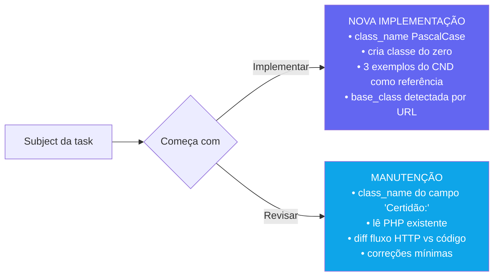

# 05 - Skill /auto — Orquestrador

← Voltar para [[CND Automation — Documentação Técnica|Home]] · fluxograma: [[03 - Pipeline — Fluxo Completo]]

A skill `/auto` vive em `.claude/skills/auto/SKILL.md`. É o **cérebro** do pipeline: o servidor MCP só expõe [[04 - Tools MCP — Referência|tools atômicas]], e é a skill que decide qual chamar, em que ordem, quando retentar e como tratar falhas. Por viver em markdown, o fluxo evolui **sem rebuildar TypeScript**.

A skill é disparada pelo [[14 - Operação e Agendamento|Task Scheduler]] todo dia às 07:00 (`claude -p "/auto"`).

---

## Configuração da skill

- **`MAX_TAREFAS = 5`** — limite de tarefas por execução agendada (editável no topo do SKILL.md).
- Contador persistido em `.claude/auto_count` (um inteiro em texto puro).
- O contador **só incrementa em sucesso (PASSO 12)** ou **falha registrada (PASSO 11)**. Encerramentos por pausa, fila vazia ou erro de ambiente **não contam**.
- Reset do ciclo: `Remove-Item .claude/auto_count`.

## Pré-requisito de ambiente (não pular)

O repo CND é Laravel 6 e **só roda em PHP 7.4**. Por isso o [[09 - Geração e Teste do Código PHP|pipeline_test]] **deve** rodar dentro do container `configs-development-app-1` (PHP 7.3.33). Se o `artisan_output` voltar com paths do host ou erros de `ArrayAccess`/`ReflectionParameter::getClass`, o MCP está usando o PHP do host → **reiniciar o MCP** (env só é lida no spawn). Não consertar `helpers.php` nem propor downgrade. Ver [[13 - Configuração — Variáveis de Ambiente]].

---

## Os 13 passos

| # | Passo | Ação |
|---|-------|------|
| 1 | Verificar pausa e limite | `Test-Path .claude/STOP`; ler `.claude/auto_count` vs `MAX_TAREFAS` |
| 2 | Buscar próxima tarefa | `redmine_next_task`; anotar `id`, `subject`, `description` e o **`inicio`** (timestamp ISO) usado nas notificações |
| 3 | Detectar tipo de operação | subject `Implementar` → NOVA IMPLEMENTAÇÃO; `Revisar` → MANUTENÇÃO. Extrai `type`, `state`, `url`, `cnpj`, inputs, instruções, expectativas |
| 3A | (Impl.) Definir `class_name` | PascalCase da cidade/órgão, prefixo `Certificate`, sem acentos |
| 3B | (Manut.) Ler classe existente | `class_name` do campo `Certidão:`; localizar e ler o `.php` no CND |
| 4 | Consultar knowledge base | ler `.claude/patterns/{federal\|state}/{class}.md` e `.../bases/{Base}.md` no repo CND |
| (3→) | Em Desenv. | `redmine_update_task` 56→57 |
| 5 | Discovery | `pipeline_discover` (URL, inputs, fluxo, complexidade) |
| 6 | Captura do browser | montar `nav_steps` a partir das instruções; `pipeline_browser_capture`; tratar `failed_step`, fallback AHK, HAR parcial |
| 7 | Extração do HAR | `pipeline_extract_har` |
| 8 | Interpretação | `pipeline_interpret_flow` |
| 9A | (Impl.) Gerar PHP | `pipeline_generate_code` → Claude escreve a classe → `pipeline_test` |
| 9B | (Manut.) Corrigir PHP | diff fluxo HTTP atual vs código → correções mínimas → `pipeline_test` |
| 10 | Retry no teste | analisar `artisan_output`, corrigir, retestar (até **3 tentativas**) |
| 11 | Registrar falha | `redmine_update_task` 56 + reatribui ao Analista (875) + nota humana; `notify_google_chat` ERRO; contador++ |
| 12 | Commit + sucesso | `pipeline_commit`; `redmine_update_task` 84 + nota padrão; `notify_google_chat` SUCESSO; contador++ |
| 13 | Atualizar knowledge base | criar/atualizar `.claude/patterns/...` no CND + commit dos docs |

---

## Modos de operação

| Característica | Implementação | Manutenção |
|---|---|---|
| Gatilho (subject) | `Implementar…` | `Revisar…` |
| `class_name` | gerado em PascalCase | lido do campo `Certidão:` |
| Código base | gerado do zero pelo Claude | lido do repositório CND |
| Foco | estrutura completa | correção mínima |
| Usa `pipeline_generate_code` | ✅ | ❌ (usa o código existente) |

---

## Tratamento do HAR incompleto (PASSO 6)

Quando a captura falha, o HAR parcial ainda tem valor (cookies, CSRF, headers e payloads reais). A skill decide:

- **NOVA IMPLEMENTAÇÃO** — aproveita o HAR parcial sempre que houver ≥1 passo capturado: usa os requests reais para os primeiros N passos e completa o resto com template/classe-irmã.
- **MANUTENÇÃO, falha no meio/fim** — compara request a request o que a classe atual envia vs o HAR; corrige direto no código.
- **MANUTENÇÃO, falha nos primeiros steps** — pula o HAR e roda `pipeline_test` com o código atual; o `artisan_output` aponta o que mudou.

O **fallback AHK** entra como 3ª tentativa quando todos os `nav_steps` são texto puro. Ver [[07 - Fallback AHK — OCR + AutoHotkey]].

---

## Notas padronizadas no Redmine

Ver o template exato em [[10 - Integração Redmine]]. Pontos obrigatórios:
- nota de **sucesso** (PASSO 12) segue o template "Alterações realizadas / Projetos e Arquivos Modificados / **Branch: cnd-automation**";
- a linha `Branch: cnd-automation` é **obrigatória** — diz ao revisor de qual branch abrir o merge request;
- nota de **falha** (PASSO 11) começa com "Tentativa de resolução automática pela CND Automation — não foi possível concluir." + `Motivo:`.

---

## Veja também
- [[03 - Pipeline — Fluxo Completo]] — diagrama com os passos.
- [[15 - Convenções das Classes Certificate]] — como o Claude escreve o PHP no PASSO 9A.
- [[14 - Operação e Agendamento]] — agendamento, pause/resume, contador.
