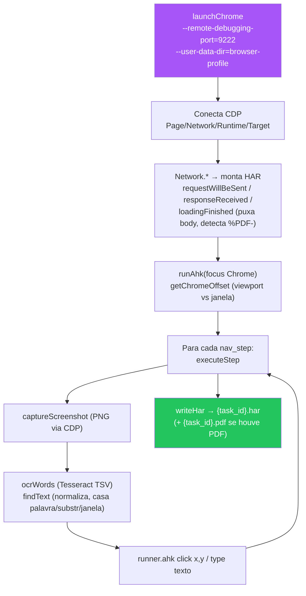

# 07 - Fallback AHK — OCR + AutoHotkey

← Voltar para [[CND Automation — Documentação Técnica|Home]] · tools: `pipeline_browser_capture_ahk` (`src/tools/browser_ahk.ts`), OCR (`src/tools/ocr.ts`), runner (`resources/ahk/runner.ahk`)

Quando o [[06 - Captura de Browser — Playwright|Playwright]] falha **2x** no mesmo portal — seja por anti-bot (Cloudflare interativo, Flutter Web em canvas), seja por timing/seletor que o Claude não consegue corrigir — a **3ª tentativa** é o fallback AHK. Ele sobe um **Chrome real** via CDP, dirige **cliques e digitação OS-level** com AutoHotkey, e localiza elementos por **OCR (Tesseract)** em vez de seletor. Input OS-level é praticamente indistinguível de humano.

---

## Regra de decisão (na skill)

- **Todos os `nav_steps` são texto** (`goto`, `wait`, `click_text`, `fill_field`, `select_text`) → **chamar AHK sempre**, independente da causa aparente da 2ª falha. (O input mais real + profile compartilhado podem destrancar o portal.)
- **Algum step usa `selector`/`fill`/`click`/`select`/`frame_*`** → AHK **rejeita** (não há DOM para inspecionar). Pula direto para o HAR parcial / `pipeline_test`.

---

## Como funciona



1. **Chrome real** (`CHROME_BINARY`) sobe com `--remote-debugging-port=9222`, janela 1280×900 em (0,0), usando o **mesmo `browser-profile/`** do Playwright (cookies `cf_clearance` já viajam). Locks de execução anterior (`SingletonLock`/`Cookie`/`Socket`) são limpos antes.
2. **CDP** habilita `Page`/`Network`/`Runtime`. Os eventos `Network.*` são convertidos incrementalmente em entradas HAR (request + response + body). Body em base64 com magic bytes `%PDF-` vira `pdf_path`.
3. **AHK traz o Chrome para foreground** e calcula o `offset` Y entre a janela e o viewport (para converter coordenadas do screenshot em coordenadas de tela).
4. Para cada step: **screenshot via CDP → OCR (Tesseract) → `findText` → clique/digitação via `runner.ahk`**.
5. Após `goto`, espera o challenge cair (`waitForChallengeCleared`): poll leve de `document.title` (15s, ou **45s** se o Playwright sinalizou Cloudflare em `playwright_diagnostics`).
6. Ao final, grava o HAR (mesmo parcial) — compatível com [[08 - Extração e Interpretação de HAR|pipeline_extract_har]].

---

## OCR — `src/tools/ocr.ts`

- `ocrWords(png, "por+eng")` roda o Tesseract em modo **TSV** (`--psm 6`, "single uniform block"), emitindo 1 linha por palavra com bounding box. Usa `--tessdata-dir resources/tessdata` (treinos `por`/`eng`/`osd` versionados no repo — evita escrever em `Program Files`).
- `findText(words, query)`: normaliza (lowercase, sem acento, sem pontuação) e tenta, nesta ordem: casamento exato de palavra (conf ≥ 40) → substring → janela de N palavras consecutivas para textos como "Gerar Certidão" (conf ≥ 30). Retorna o **centro** da bbox, pronto para `Click`.
- `executeStep` para `fill_field` clica ~20px à direita do label (no Flutter o input fica ao lado) antes de digitar; `select_text` clica no label, espera a animação, OCR procura o valor e clica.

## Runner AutoHotkey — `resources/ahk/runner.ahk`

Invocado por step: `AutoHotkey64.exe runner.ahk <action> <args>`. Imprime `OK`/`ERR:` e exit code 0/1.

| Action | Efeito |
|--------|--------|
| `click <x> <y>` | move + clica em coordenadas absolutas |
| `dblclick <x> <y>` | duplo clique |
| `move <x> <y>` | move o mouse (debug) |
| `type <text>` | `SendText` (preserva acentos, não interpreta `{}`) |
| `key <keyname>` | pressiona tecla (Tab/Enter/Esc) |
| `focus <substr>` | `WinActivate` por substring do título + ` ahk_exe chrome.exe` |

---

## Instalação (uma vez por máquina)

```powershell
winget install --id AutoHotkey.AutoHotkey
winget install --id UB-Mannheim.TesseractOCR

# pacote português do Tesseract + copiar eng/osd para o repo
curl.exe -L -o resources\tessdata\por.traineddata `
  https://github.com/tesseract-ocr/tessdata_fast/raw/main/por.traineddata
Copy-Item "C:\Program Files\Tesseract-OCR\tessdata\eng.traineddata" resources\tessdata\
Copy-Item "C:\Program Files\Tesseract-OCR\tessdata\osd.traineddata" resources\tessdata\
```

Binários configuráveis no [[13 - Configuração — Variáveis de Ambiente|.env]]: `CHROME_BINARY`, `AHK_BINARY`, `TESSERACT_BINARY` (defaults assumem instalação padrão via winget).

---

## Limitações

- Só `goto`/`wait`/`click_text`/`fill_field`/`select_text`. Actions com selector são rejeitadas.
- Cada step com OCR é ~500ms mais lento (screenshot + tesseract).
- A janela do Chrome precisa ficar **em foreground durante toda a execução** — não use o PC enquanto roda.

---

## Veja também
- [[06 - Captura de Browser — Playwright]] — o caminho padrão e os sinais que levam ao fallback.
- [[12 - Captcha — CapMonster e Solver PHP]] — por que o anti-bot acontece.
