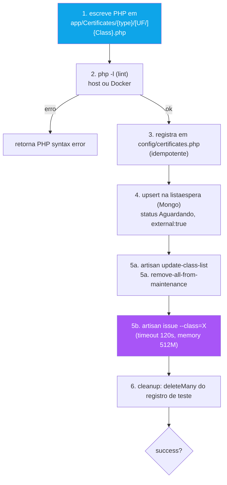

# 09 - Geração e Teste do Código PHP

← Voltar para [[CND Automation — Documentação Técnica|Home]] · tools: `pipeline_generate_code` (`src/tools/generate.ts`), `pipeline_test` (`src/tools/test.ts`), `pipeline_commit` (`src/tools/commit.ts`)

Esta é a etapa em que o fluxo interpretado vira **código PHP** no repo CND, é **testado de verdade** (`artisan issue`) e, em sucesso, **commitado**.

---

## `pipeline_generate_code` — monta contexto (não escreve PHP)

Importante: esta tool **não gera o código**. Ela reúne contexto para que o **Claude** escreva a classe seguindo o campo `instructions`.

Retorna:
- **`base_class`** — detectada pelas URLs do fluxo:

| URL contém | Base class |
|------------|-----------|
| `betha.com.br` | `CertificateBethaCND` |
| `fiorilli` | `CertificateFiorilli` |
| `/gpi` ou `gpi.*.gov.br` | `CertificateGpi` |
| `governa` | `CertificateGoverna` |
| `atendenet` | `CertificateAtendeNet` |
| `abaco` | `CertificateAbaco` |
| `prefweb` | `CertificatePrefWeb` |
| (nenhum) | `CertificateBase` |

- **`namespace`** — `App\Certificates\Federal`, `App\Certificates\State`, ou `App\Certificates\Municipal\{UF}`.
- **`examples`** — até 3 classes `.php` (cada < 3 KB) do diretório alvo, como referência estrutural.
- **`blocks_memory`** — até 3 KB do `CND_BLOCKS_MEMORY.json` (em `{CND}/.claude/blocks/`).
- **`instructions`** — frase única dizendo o que gerar, incluindo a **ordem dos membros** (URLs → headers → payloads → funções). Ver [[15 - Convenções das Classes Certificate]].

---

## `pipeline_test` — escreve, linta, testa

Sequência (em `src/tools/test.ts`):



Detalhes:
- **Docker.** Quando `DOCKER_CONTAINER` está setado (sempre, na prática), `php -l` e `artisan` rodam **dentro do container** (PHP 7.3). O path do arquivo é traduzido de `GIT_WORKING_DIR` para `DOCKER_WORKING_DIR`. Ver [[13 - Configuração — Variáveis de Ambiente]].
- **MongoDB upsert.** Insere/reaproveita um doc em `listaespera` com filtro `{classname, inscfederal, external:true}` — reaproveita entre retentativas em vez de empilhar duplicados. `cnpj` deve ser **só dígitos** (o insert espera o valor cru).
- **Preparação idempotente.** `update-class-list` adiciona classes novas (entram em manutenção por default) e `remove-all-from-maintenance` as libera, para o `issue` rodar de fato.
- **Cleanup best-effort.** Remove o registro de teste depois (mesmo se o artisan deixou status `Erro`/`Concluído`).

### Heurística de sucesso

```ts
hasSuccess = /checkpoint|emitida|success|certidão gerada|concluída/  // no artisan_output (lower)
hasError   = /exception|fatal error|undefined/
success    = configErrors.length === 0 && (hasSuccess || (!hasError && output não vazio))
```

> ⚠️ É um match por substring — pode dar falso-positivo/negativo. Ver [[17 - Limitações, Riscos e Roadmap]]. Em falha, a skill lê o `artisan_output`, corrige o PHP e retesta (até 3 tentativas).

---

## `pipeline_commit` — consolida e publica

Após sucesso (`src/tools/commit.ts`):

```bash
# garante a branch correta
git rev-parse --abbrev-ref HEAD          # se != cnd-automation:
git checkout cnd-automation
git add "{certPath}" "config/certificates.php"
git commit -m "#{task_id} - {task_subject}"
git fetch origin cnd-automation
git pull --rebase origin cnd-automation
git push origin cnd-automation
# FASE 8 do cnd-engine:
php artisan update-class-list            # (no Docker)
```

Pontos:
- **Commit único por tarefa**, sempre na branch **`cnd-automation`** (valor de `GIT_BRANCH`). Ver `CLAUDE.md` — se foi preciso ajustar o código depois, `git reset --soft HEAD~N` e recommit, nunca fragmentar.
- O commit adiciona **só** a classe PHP + `config/certificates.php`. **Não** adiciona mais o `CND_BLOCKS_MEMORY.json` (commit `2d913cb`). A descrição da tool em `index.ts` está desatualizada nesse ponto.
- Faz **push** automático (commit `7db60ad`) — antes era só local.

---

## Registro em `config/certificates.php`

O array tem três seções (`FEDERAL`, `ESTADUAL`, `MUNICIPAL`); a Municipal é subdividida por UF (`// AC`, `// AL`, …). A entrada deve ficar **na seção/UF certa**, em **ordem alfabética** (case-insensitive). O `pipeline_test` insere automaticamente antes do `];` final — por isso, se a entrada cair "solta" no fim do arquivo, a skill deve **realocá-la** antes de testar/commitar. Ver [[15 - Convenções das Classes Certificate]] e o `CLAUDE.md`.

---

## Veja também
- [[15 - Convenções das Classes Certificate]] — padrão de orquestração, ordem dos membros, `fixHtml`, `processIssuance`.
- [[12 - Captcha — CapMonster e Solver PHP]] — por que o PHP gerado nunca integra CapMonster.
- [[16 - Knowledge Base e Memória de Time]] — o que é registrado após o sucesso (PASSO 13).
