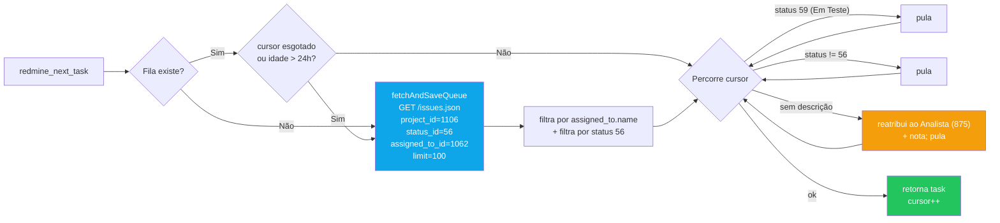

# 10 - Integração Redmine

← Voltar para [[CND Automation — Documentação Técnica|Home]] · implementação: `src/tools/redmine.ts`

O Redmine é a **fonte das tarefas** e o **registro de resultado**. O servidor MCP fala direto com a API REST (`X-Redmine-API-Key`), sem MCP intermediário.

---

## Fila local



- Persistida em `WORK_DIR/state/task_queue.json` → `{ fetched_at, total_count, cursor, tasks[] }`.
- **TTL 24h** (`QUEUE_TTL_MS`). Auto-refresh se ausente, esgotada ou velha — sinalizado por `auto_refreshed: true` no retorno.
- A fila só carrega tarefas no status `REDMINE_NEXT_TASK_STATUS` (default **56** Ag. Desenv.). Sem esse filtro, com `limit=100` as tarefas de 56 podiam nem entrar na página.
- **Skip por status**: `REDMINE_NEXT_TASK_SKIP_STATUSES` (default **59** Em Teste) evita reimplementar uma certidão que outro dev já entregou.
- **Tarefas sem descrição** são reatribuídas ao Analista (`REDMINE_FAILURE_ASSIGNEE_ID`) com nota pedindo os detalhes, e puladas (commit `a4c2cc7`).

`redmine_get_tasks` força um fetch (parâmetros customizáveis) e **regrava** a fila — útil para refresh manual.

---

## Status usados

| Status | ID | Quando |
|--------|----|--------|
| Em Desenv. | `57` (`REDMINE_STATUS_EM_DESENV`) | início do processamento de uma tarefa |
| Ag. Review | `84` (`REDMINE_STATUS_AG_REVIEW`) | pipeline concluiu e commitou |
| Ag. Desenv. | `56` (`REDMINE_STATUS_AG_DESENV`) | origem das tarefas / destino em falha |

### ⚠️ Transição 56 → 84 não funciona direto

O Redmine aceita a chamada mas **não muda** o status se você pular de Ag. Desenv. (56) direto para Ag. Review (84). A sequência válida é:

1. `56` → `57` (ao começar a trabalhar)
2. `57` → `84` (ao concluir)

Se a tarefa está em 56 e precisa ir pra 84, faça **duas chamadas** de `redmine_update_task` em sequência. (Regra do `CLAUDE.md`.)

---

## Reatribuição (grupos)

| Var | ID | Papel |
|-----|----|-------|
| `REDMINE_ASSIGNED_TO_ID` | `1062` | grupo "Desenvolvimento Web" — **origem** das tarefas |
| `REDMINE_FAILURE_ASSIGNEE_ID` | `875` | grupo "Analista de Negocio Web/Imobiliario" — **destino** em falha ou tarefa sem descrição |

Em falha (PASSO 11), além de voltar para 56, a tarefa é reatribuída ao 875 para avaliação manual.

---

## Notas padronizadas

### Sucesso (PASSO 12) — template obrigatório
```
Alterações realizadas:
> {Implementação da classe {ClassName} para emissão automática de certidão.
   | Correção da classe {ClassName} — {descrição curta do que foi corrigido.}}

Projetos e Arquivos Modificados:
> cnd — {caminho relativo do arquivo PHP}
> cnd — config/certificates.php

Branch: cnd-automation
```
A linha **`Branch: cnd-automation` é obrigatória** — diz ao revisor de qual branch do repo CND abrir o merge request. Sem prosa adicional; detalhes técnicos vão no commit message, não na nota.

### Falha (PASSO 11)
```
Tentativa de resolução automática pela CND Automation — não foi possível concluir.

Motivo: {descrição humana do erro}
```
Exemplos de motivo: "Captcha detectado na página de emissão", "Parâmetro `inscricaoMunicipal` não encontrado no retorno", "Portal bloqueou a requisição (possível detecção de bot)".

---

## API (resumo)

| Função | Endpoint |
|--------|----------|
| listar / fila | `GET /issues.json?project_id&status_id&assigned_to_id&limit&offset` |
| atualizar | `PUT /issues/{id}.json` com `{ issue: { status_id?, notes?, assigned_to_id? } }` |

Configuração em [[13 - Configuração — Variáveis de Ambiente]].

---

## Veja também
- [[05 - Skill auto — Orquestrador]] — quando cada transição acontece.
- [[11 - Notificações Google Chat]] — o card enviado junto com a atualização de status.
