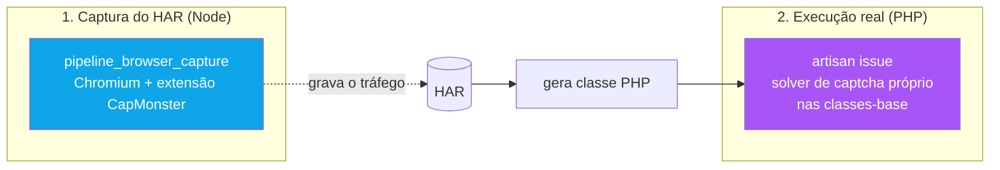

# 12 - Captcha — CapMonster e Solver PHP

← Voltar para [[CND Automation — Documentação Técnica|Home]]

Captcha é tratado em **duas camadas independentes** — uma na captura, outra na execução real. Confundir as duas é o erro mais comum. (Regra dura do `CLAUDE.md`.)

---

## Camada 1 — CapMonster (só no HAR capture)

- Extensão Chromium versionada em `resources/capmonster/`, carregada pelo [[06 - Captura de Browser — Playwright|pipeline_browser_capture]] via `--load-extension`.
- **Pago.** Usado **apenas** para resolver captcha durante a gravação do HAR.
- **Setup uma vez por máquina:** rodar qualquer `pipeline_browser_capture`, fixar a extensão, colar a **Client Key** do dashboard CapMonster. A chave persiste em `browser-profile/` (gitignored).
- Os hosts de captcha (recaptcha, gstatic, hcaptcha, `challenges.cloudflare.com`) estão na whitelist do bloqueador de assets — caso contrário o solver não conseguiria carregar imagens/CSS/fontes para classificar os tiles.

## Camada 2 — Solver PHP próprio (execução real)

- A CND tem **solver de captcha próprio em PHP**, embutido nas classes-base. É ele que atua quando `artisan issue` roda de verdade.

---

## Regras (não violar)

1. **Nunca** sugerir integrar CapMonster no **PHP gerado** — a CND já tem solver próprio. O PHP nunca chama CapMonster.
2. O limite de **2 tentativas** no HAR capture é **controle de custo**, não bug. Não aumentar sem conversar.
3. Falha de captcha no `artisan issue` → problema no **solver PHP / herança da classe-base**, não na extensão. Não "consertar" mexendo na extensão.

---

## Anti-bot ≠ captcha

Cloudflare challenge interativo e Flutter Web em canvas **não** são captcha clássico — são detecção de automação. A resposta a eles é o [[07 - Fallback AHK — OCR + AutoHotkey|fallback AHK]] (input OS-level + profile com `cf_clearance` acumulado), não o solver. Os sinais para distinguir estão em [[06 - Captura de Browser — Playwright]].

---

## Veja também
- [[06 - Captura de Browser — Playwright]] — onde a CapMonster atua.
- [[07 - Fallback AHK — OCR + AutoHotkey]] — resposta ao anti-bot.
- [[08 - Extração e Interpretação de HAR]] — FlowType `CAPTCHA` detecta `cf-turnstile`/`hcaptcha`.
