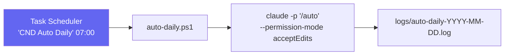

# 14 - Operação e Agendamento

← Voltar para [[CND Automation — Documentação Técnica|Home]] · scripts: `scripts/`, `stop-pipeline.ps1`, `resume-pipeline.ps1`

## Modo autônomo (agendado)

O `/auto` é disparado **todos os dias às 07:00** pelo **Task Scheduler do Windows** (não é mais `/loop`). Cada execução processa no máximo `MAX_TAREFAS` (default **5**) tarefas e então encerra.



### Instalar o agendamento (uma vez por máquina)
```powershell
powershell -ExecutionPolicy Bypass -File .\scripts\install-scheduled-task.ps1
```
Cria a task **"CND Auto Daily"** no Task Scheduler do usuário (não precisa Admin). Detalhes do registro (`install-scheduled-task.ps1`):
- Trigger: `-Daily -At "07:00"` (hora local).
- Settings: `-StartWhenAvailable` (dispara assim que possível se o PC estava desligado), `-AllowStartIfOnBatteries`, limite de execução de 4h.
- Principal: usuário interativo (`LogonType Interactive`, `RunLevel Limited`).
- Ação: `powershell.exe -NoProfile -ExecutionPolicy Bypass -File auto-daily.ps1`.

### O runner — `scripts/auto-daily.ps1`
- Cria `logs/` se não existir, loga início/fim em `logs/auto-daily-YYYY-MM-DD.log`.
- Executa `claude -p "/auto" --permission-mode acceptEdits *>> $LogFile` no diretório do projeto.
- ⚠️ Confirme que sua versão do CLI do Claude Code aceita esses flags; ajuste se necessário.

### Conferir / desinstalar
```powershell
Get-ScheduledTask -TaskName "CND Auto Daily" | Get-ScheduledTaskInfo   # status e próximo disparo
Start-ScheduledTask -TaskName "CND Auto Daily"                          # disparar manualmente
Unregister-ScheduledTask -TaskName "CND Auto Daily" -Confirm:$false     # remover
```

---

## Contador de tarefas (`MAX_TAREFAS`)

- `MAX_TAREFAS = 5` definido no topo do [[05 - Skill auto — Orquestrador|SKILL.md]].
- Contador persistido em `.claude/auto_count` (inteiro em texto puro).
- Incrementa **só** em sucesso (PASSO 12) ou falha registrada (PASSO 11). Pausa/fila vazia/erro de ambiente **não** contam.
- **Resetar o ciclo:**
```powershell
Remove-Item .claude\auto_count
```

---

## Pausar / retomar

| Ação | Comando | Efeito |
|------|---------|--------|
| Pausar | `.\stop-pipeline.ps1` | cria `.claude\STOP` (na verdade `$PSScriptRoot\STOP`); o agente termina a tarefa atual e para no início do próximo ciclo |
| Retomar | `.\resume-pipeline.ps1` | remove o arquivo `STOP` |

No PASSO 1, a skill faz `Test-Path c:\Workspace\cnd-automation\STOP` — existindo, exibe "⏸ Pipeline pausado" e encerra.

> ⚠️ Detalhe de path: `stop-pipeline.ps1` cria `STOP` em `$PSScriptRoot` (raiz do repo), e o SKILL checa `c:\Workspace\cnd-automation\STOP`. Mantenha o repo nesse path para os dois baterem.

---

## Uso manual (tarefa avulsa)

Também dá para rodar uma tarefa específica chamando as [[04 - Tools MCP — Referência|tools]] direto pelo Claude Code:
```
use redmine_get_tasks to fetch open tasks, then run pipeline for task #1234
```

| Ação | Como |
|------|------|
| Iniciar autônomo (1 ciclo) | `claude -p "/auto"` ou disparar a task |
| Forçar refresh da fila | `redmine_get_tasks` |
| Restart do MCP (após build/.env) | `/mcp` no Claude → restart |

---

## Auto-atualização da documentação (esta doc)

Esta documentação no Obsidian se mantém atualizada sozinha, por uma rotina **separada** do `/auto`:

- **Skill `/update-docs`** (`.claude/skills/update-docs/SKILL.md`) — levanta **todas** as alterações líquidas desde a última sincronização (`git diff --name-only último..HEAD`, cobrindo **todos** os commits do intervalo, não só o último) e, para cada arquivo afetado, **reconcilia a nota lendo o arquivo-fonte como ele está agora** (verifica contra o projeto atual, não aplica diff cego). Atualiza **só as notas afetadas** e registra em [[Changelog]]. Sem baseline (`.claude/docs_sync_commit` apagado) → reconciliação completa.
- **Runner** `scripts/docs-daily.ps1` — roda `claude -p "/update-docs"` headless com `--permission-mode bypassPermissions` (evita travar esperando aprovação num run desatendido; a skill só lê git e escreve em `docs/`). Loga em `logs/docs-daily-YYYY-MM-DD.log`.
- **Agendamento** `scripts/install-docs-task.ps1` — registra a task **"CND Docs Daily"** às **18:00** (fim do expediente, captura os commits do dia).
- **Estado** em `.claude/docs_sync_commit` (hash do último commit já documentado; gitignored). Apague para forçar reconciliação completa.
- **Local da doc:** as notas vivem em `cnd-automation/docs/` (dentro do repo, versionadas). O `/update-docs` **não** commita — o **commit/push é manual** (você publica quando quiser; o time recebe no `git pull`).
- **Hook `post-commit`** (`.git/hooks/update-obsidian-status.ps1`, separado do `/update-docs`): a **cada commit** regenera `docs/00 - Status do Projeto.md` — um resumo do **último commit**, sem IA. Esse arquivo é **gitignored** (painel local). Quem cobre **todas** as alterações e atualiza o conteúdo é o `/update-docs` diário.

```powershell
# instalar (uma vez por máquina)
powershell -ExecutionPolicy Bypass -File .\scripts\install-docs-task.ps1

# rodar manualmente agora
claude -p "/update-docs"        # ou /update-docs dentro do Claude Code

# conferir / desinstalar
Get-ScheduledTask -TaskName "CND Docs Daily" | Get-ScheduledTaskInfo
Unregister-ScheduledTask -TaskName "CND Docs Daily" -Confirm:$false
```

> Há **duas** tarefas agendadas independentes: **"CND Auto Daily"** (07:00, processa certidões) e **"CND Docs Daily"** (18:00, atualiza esta doc).

---

## Veja também
- [[05 - Skill auto — Orquestrador]] — o que cada ciclo executa.
- [[13 - Configuração — Variáveis de Ambiente]] — env lida no spawn.
- [[17 - Limitações, Riscos e Roadmap]] — riscos operacionais (browser headed, foreground do AHK).
- [[Changelog]] — histórico das atualizações desta documentação.
