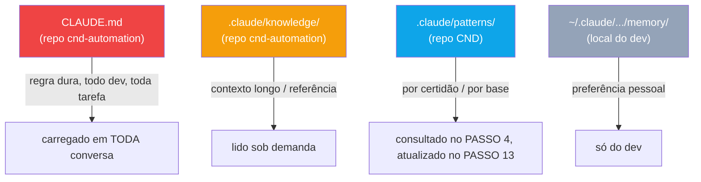

# 16 - Knowledge Base e Memória de Time

← Voltar para [[CND Automation — Documentação Técnica|Home]]

O projeto tem **quatro camadas de memória**, cada uma com um propósito e um custo de contexto diferente. Saber em qual camada algo vai é parte de "treinar" o agente.



---

## 1. `CLAUDE.md` (regras duras)
No repo `cnd-automation`, carregado em **toda conversa**. Regras curtas e de alto valor que valem para todo dev em toda tarefa (stack, captcha, transições Redmine, formato das notas, padrão das classes Certificate, registro no config). Mudança = **PR com review obrigatório**.

## 2. `.claude/knowledge/` (contexto longo)
No repo `cnd-automation`, lido **sob demanda** (não custa tokens em toda tarefa). Arquitetura, histórico de decisões, catálogo de gotchas de um portal/órgão. Referenciado explicitamente pelo `CLAUDE.md` quando relevante.

## 3. `.claude/patterns/` (knowledge base operacional) — no repo **CND**
Esta é a memória que o `/auto` **consulta e alimenta** a cada tarefa:

```
C:\Workspace\cnd\.claude\patterns\
├── bases\
│   ├── CertificateBethaCND.md
│   ├── CertificateGpi.md
│   └── ...
├── federal\
│   └── {ClassName}.md
└── state\
    └── {ClassName}.md
```

- **PASSO 4 (consulta):** antes de implementar/corrigir, lê o arquivo da certidão e o da base — fluxo, parâmetros críticos, armadilhas.
- **PASSO 13 (atualiza):** após sucesso, atualiza a "Última execução bem-sucedida" da base e cria/atualiza o arquivo da certidão. Commit: `docs: atualiza knowledge base — {class_name} #{task_id}`.

### Arquivo da certidão
```markdown
# {class_name}
**Base:** {BaseClass}
**Localização:** `app/Certificates/{type}/{class_name}.php`

## Fluxo PHP
{passos resumidos específicos desta certidão}

## Parâmetros críticos
{parâmetros não óbvios deste portal}

## Armadilhas conhecidas
{problemas encontrados nos retries — omitir se nenhum}

## Última execução bem-sucedida
- {AAAA-MM-DD} | Tarefa #{task_id}
```

### Arquivo da base
```markdown
## Última execução bem-sucedida
- {AAAA-MM-DD} | Tarefa #{task_id} | {class_name}
```

## 4. `CND_BLOCKS_MEMORY.json` — no repo CND
Em `{CND}/.claude/blocks/`. Padrões de blocos lidos pela [[09 - Geração e Teste do Código PHP|pipeline_generate_code]] (até 3 KB) como contexto. **Não** é mais incluído no commit do `pipeline_commit` (commit `2d913cb`).

## 5. Memória local do dev
`~/.claude/projects/.../memory/` — preferências pessoais, não versionadas. Ex. registrado: ao montar o `insertOne` de uma nova CND, deixar `Codtypecertificate` como placeholder (o usuário preenche manualmente).

---

## Como treinar o agente

Quando o agente errar durante `/auto`, corrija na hora **explicando o porquê**:
- **Regra dura, vale pra todos** → editar `CLAUDE.md` (PR).
- **Contexto longo / referência** → arquivo em `.claude/knowledge/` linkado do `CLAUDE.md`.
- **Preferência pessoal** → memória local do dev.

---

## Veja também
- [[05 - Skill auto — Orquestrador]] — PASSOS 4 e 13.
- [[15 - Convenções das Classes Certificate]] — regras que vivem no `CLAUDE.md`.
