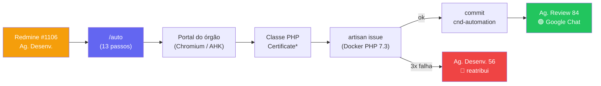

# CND Automation — Documentação Técnica

> **Home / índice** da documentação do projeto `cnd-automation`: um servidor **MCP** + a skill **`/auto`** do Claude Code que automatizam a implementação e a manutenção das classes PHP de captura de certidões (CND) consumidas pelo sistema **CND** da Questor.
>
> - **Repositório:** `cnd-automation` (branch principal `main`, trabalho em `develop`)
> - **Repositório consumidor:** `git@gitlab.questor.com.br:timeweb/cnd.git` (Laravel 6 / PHP 7.4)
> - **Última sincronização desta doc:** 2026-05-27 · branch `develop` · commit base `7db60ad`

Esta nota é o ponto de entrada. Cada tópico vive em sua própria nota interligada (estilo Obsidian). Comece pela [[01 - Visão Geral e Arquitetura]] e siga o [[03 - Pipeline — Fluxo Completo|fluxo]].

---

## 🗺️ Mapa da documentação

### Fundamentos
- [[01 - Visão Geral e Arquitetura]] — o que o projeto faz, por que existe, diagrama macro.
- [[02 - Stack, Estrutura e Build]] — tecnologias, árvore de arquivos, como compilar.
- [[Glossário]] — termos do domínio (CND, listaespera, FlowType, Ag. Review…).

### O pipeline, ponta a ponta
- [[03 - Pipeline — Fluxo Completo]] — fluxograma autônomo (13 passos) + lógica de retry.
- [[04 - Tools MCP — Referência]] — as 12 tools expostas pelo servidor MCP.
- [[05 - Skill auto — Orquestrador]] — o "cérebro" que orquestra as tools.

### Etapas técnicas
- [[06 - Captura de Browser — Playwright]] — Chromium + CapMonster, nav_steps, HAR.
- [[07 - Fallback AHK — OCR + AutoHotkey]] — 3ª tentativa quando o Playwright falha.
- [[08 - Extração e Interpretação de HAR]] — filtro do HAR e classificação do fluxo.
- [[09 - Geração e Teste do Código PHP]] — contexto p/ Claude + lint + Mongo + artisan.
- [[12 - Captcha — CapMonster e Solver PHP]] — as duas camadas de captcha.

### Integrações
- [[10 - Integração Redmine]] — fila local, status, reatribuição em falha.
- [[11 - Notificações Google Chat]] — cards de SUCESSO/FALHA por tarefa.

### Operação
- [[13 - Configuração — Variáveis de Ambiente]] — `.env`, `.mcp.json`, permissões.
- [[14 - Operação e Agendamento]] — Task Scheduler, pause/resume, contador.
- [[16 - Knowledge Base e Memória de Time]] — `.claude/patterns/`, `CLAUDE.md`, knowledge.

### Convenções e qualidade
- [[15 - Convenções das Classes Certificate]] — padrão de orquestração + ordem dos membros.
- [[17 - Limitações, Riscos e Roadmap]] — pontos de atenção e próximos passos.

### Manutenção desta documentação
- [[Changelog]] — histórico das atualizações automáticas (skill `/update-docs`, diária às 18:00).
- Como a doc se mantém atualizada: ver [[14 - Operação e Agendamento]] → seção "Auto-atualização da documentação".

---

## ⚡ TL;DR (para quem chega agora)

1. Uma tarefa entra no **Redmine** (projeto `1106`, grupo "Desenvolvimento Web", status **Ag. Desenv. 56**) com subject `Implementar…` ou `Revisar…`.
2. Todo dia às **07:00**, o **Task Scheduler** dispara `claude -p "/auto"` (ver [[14 - Operação e Agendamento]]).
3. A skill [[05 - Skill auto — Orquestrador|/auto]] processa até **5 tarefas** por execução: descobre dados da tarefa → captura o tráfego HTTP do portal → interpreta o fluxo → gera/corrige a **classe PHP** → testa via `artisan issue` no Docker → commita na branch `cnd-automation` do repo CND.
4. Sucesso → Redmine vira **Ag. Review (84)** + card 🟢 no Google Chat. Falha após 3 tentativas → volta pra **Ag. Desenv. (56)**, é **reatribuída ao Analista de Negócio** e manda card 🔴.
5. O que funcionou é registrado na [[16 - Knowledge Base e Memória de Time|knowledge base]] dentro do repo CND.

---

## 📌 Estado atual do código (o que mudou desde a doc antiga)

A documentação anterior descrevia uma versão mais velha. O estado atual (commit base `7db60ad`) tem diferenças relevantes — registradas aqui para ninguém se confundir:

| Antes (doc antiga) | Agora (código atual) |
|---|---|
| 12 tools incluindo `pipeline_run` e `pipeline_get_state` | 12 tools, **sem** `pipeline_run`/`pipeline_get_state`; **com** `pipeline_browser_capture_ahk` e `notify_google_chat` |
| `src/state/StateManager.ts`, `src/tools/pipeline.ts`, `src/tools/decision.ts` | **removidos** — não existem mais |
| Skip de tarefa baseado em "state file existe" | Skip baseado em **status** (pula 59 Em Teste) + filtro de status da fila (só 56) + tarefas sem descrição reatribuídas |
| "Sem push automático — commits ficam locais" | `pipeline_commit` faz **fetch + pull --rebase + push** |
| Disparo via `/loop /auto` | **Task Scheduler** do Windows às 07:00, limite de `MAX_TAREFAS=5` |
| Sem notificação | **Google Chat** card por tarefa (sucesso/falha) |
| Sem fallback de captura | **Fallback AHK** (OCR + AutoHotkey) como 3ª tentativa |

Veja [[17 - Limitações, Riscos e Roadmap]] para o que ainda é dívida técnica.

---

## Referências externas

- README do repo: `C:\Workspace\cnd-automation\README.md`
- Skill: `C:\Workspace\cnd-automation\.claude\skills\auto\SKILL.md`
- Regras de time: `C:\Workspace\cnd-automation\CLAUDE.md`
- Projeto CND (consumidor): `git@gitlab.questor.com.br:timeweb/cnd.git`

---

*Índice gerado a partir do estado do repositório em 2026-05-27 (branch `develop`).*
